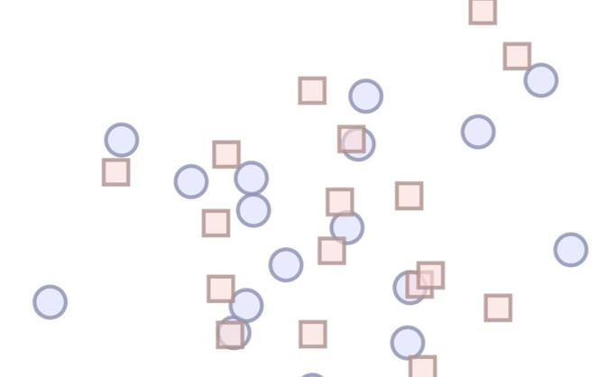
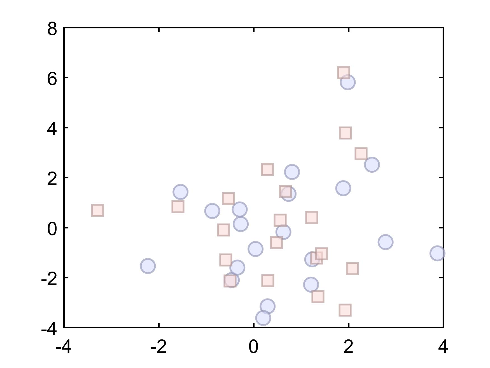

# 一个小设置让你的散点图更加有层次感

​		通过之前的文章[颜色设置小tips](https://zhuanlan.zhihu.com/p/371187553)，我们可以绘制出自己觉得非常好看的图片。比如这样


这个图片虽然颜色很好看，但是有一个小问题就是在蓝色圆和红色方框点重叠的地方，我们看的不是很清楚，非常影响我们的感官，让人总感觉下面藏了些不为人知的秘密。

​		想要解开这层“面纱”，在Matlab里面只需要在绘图代码最后加一句代码，

```matlab
figure
... % skip the scatter code
alpha(0.6)  % set the transparency of the figure
```

就可以达到这样的效果



`alpha(0.6)`里面的0.6代表设置整个图片的不透明度为60%，如果不透明，那么里面就为1，如果全透明，那么里面设置为0，也就看不到点了。

除了设置整个图片的透明度，我们还能分别设置点的Face（面）或者Edge（边缘）的透明度，设置的方法和设置颜色类似，就是设置的属性改为'MarkerFaceAlpha'与'MarkerEdgeAlpha'，具体代码如下

```
scatter(x, y, 150, ...
    'MarkerFaceColor', [216,220,254] ./ 255, % 216,220,254为颜色的RGB值，自行设置，但是RGB值在matlab里面需要归一化到0-1之间
    'MarkerEdgeColor', [250,220,218] ./ 255 - 0.3,  % -0.3只是为了使边缘颜色比表面颜色要深一些，更好看
    'LineWidth', 1.5,...
    'MarkerFaceAlpha', 0.6,  %设置表面颜色的不透明度
    'MarkerEdgeAlpha', 0.8)  % 设置边缘颜色的不透明度
```

通过上面的设置，就可以达到下面这样的效果


整体和部分的颜色层次要更分明一些。

​		在Python里，matplotlib包的[scatter绘图](https://matplotlib.org/stable/gallery/shapes_and_collections/scatter.html#sphx-glr-gallery-shapes-and-collections-scatter-py)，也可以通过修改alpha进行透明度设置

```python
plt.scatter(x, y, s=area, c=colors, alpha=0.5)
```

最后，上述图片所有**完整代码可以点击这里[github](http://link.zhihu.com/?target=https%3A//github.com/wendylay/Matlab-Code)查看**

**下期见！**

