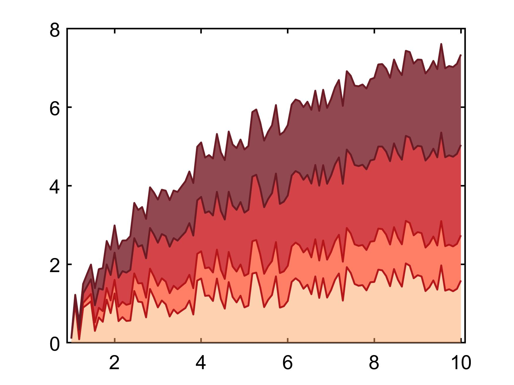

# 怎么在1分钟内**“偷”**Nature、Science等顶级期刊图片配色

​        作为优秀的科研人员、数据分析民工等等职业，内容最丰富的、大家最喜欢看的除了短视频就是**图片**，图片最直观地展示了分析的结果，一张好看的图片往往能引人注意（**比如你现在就因为我的封面点进了我的文章**）。Nature、Science等作为全球科研大佬攻坚的主要堡垒，上面的图片类型非常丰富，不仅是图片结构，更重要的是**图片的配色**（好的文章图片配色自成一体系）。

​        一般我们都会被告知：**图片颜色不能太多，重点要突出。。。。。。**还有很多介绍研究配色的文章、书籍。**但是，这些介绍文章好长，我看着好累，学起来好麻烦啊！**那么有没有人可以直接告诉我该用什么颜色什么线条啊？**必须有！安排上**。**只要一分钟，Nature、Science图片配色直接到手。**

---

下面请出我们今天的主角：[**Colorpix**](https://colorpix.en.softonic.com/)

这是一款轻量级超级神器。

1. 下载之后**点开**（左边就是ColorPix界面），它上面显示的RGB值就是鼠标当前位置像素的颜色。
2. **打开Natrue网站**（PDF/PPT/...什么都可以），找到你想学习的图片，比如下面这个图，把鼠标放在上面，然后**按下空格**，这时候你会发现Colorpix颜色不变了，右下角多了一个锁，锁住了当前颜色.
3. 鼠标**左键点击**Colorpix的RGB一行，软件默认直接复制，然后ctrl+v粘贴到Matlab/Excel/各种绘图软件中，就可以获得你想要的颜色。


比如我就学习了上面这张图的标签颜色，将RGB值复制到Matlab里面。结合上期文章[Matlab在两条线之间填充颜色](https://zhuanlan.zhihu.com/p/369887837)，绘制了类似的图。

**这里因为matlab里面的颜色默认范围是0-1，而RGB三个通道各有$2^8$个值，RGB都除以255归一化到[0,1]之间**

```matlab
x = linspace(1, 10, 100);
rd = rand(size(x));
y1 = log(x) * 0.5 + rd;
y2 = log(x) + rd;
y3 = log(x) * 2 + rd;
y4 = log(x) * 3 + rd;
% color theme (norm to 0-1)
Moderate = [253,163,98] ./ 255; 
Strong = [254,112,85] ./ 255;
Severe = [207,47,51] ./ 255;
Extreme = [133,52,61] ./ 255;
figure
hold on
fill([x, fliplr(x)], [y1, zeros(size(y1))], Moderate,...
    'EdgeColor', 'None', 'FaceAlpha', 0.5)
fill([x, fliplr(x)], [y2, fliplr(y1)], Strong,...
    'EdgeColor', 'None', 'FaceAlpha', 0.9)
fill([x, fliplr(x)], [y3, fliplr(y2)], Severe,...
    'EdgeColor', 'None', 'FaceAlpha', 0.9)
fill([x, fliplr(x)], [y4, fliplr(y3)], Extreme,...
    'EdgeColor', 'None', 'FaceAlpha', 0.9)
```



​		大家有没有觉得很香，反正我第一次用的时候鼻子好像破了。虽然好看的图片非常重要，**但是最重要的还是数据本身，没有优质的结果，再好看的图片也只是空壳**。结合这个方法，加上Matlab、Excel等工具的基础操作，一张好看的图片在几分钟内就可以完成。**这样，我们就不用纠结用哪个颜色、哪个线条、怎么画图，就可以把自己一天中剩下的23h 58m全部用于数据的探索啦~**

---

文章所有涉及到的代码都可以在我的[github](https://github.com/wendylay/Matlab-Code)获取。下期见啦~

