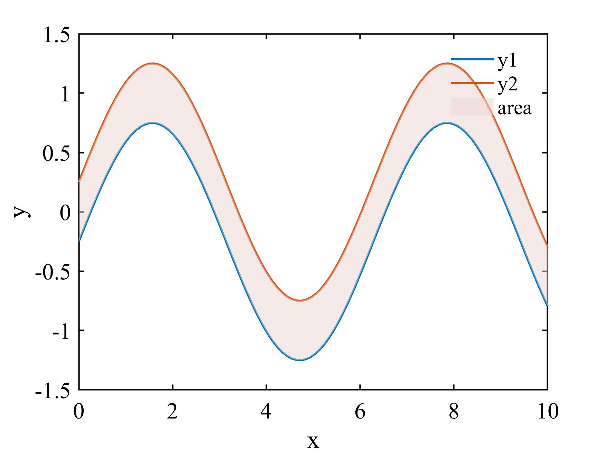

# Matlab在两条线之间填充颜色

​	平常我们绘制两条线之间没有任何修饰，这可能会显得我们绘制的图非常单调，但是我们如果在需要**强调的时候在两条线之间增加一些暖色**，就会显得我们的图非常的美观，Natrue、Science等知名期刊的文章的图的颜色组成都非常的让人喜爱。

​	今天这期就讲如何用两行代码在绘制的图上面增加颜色。

```matlab
x = linspace(0, 10, 100);
y1 = sin(x);
y2 = cos(x);
plot(x, y1, x, y2, 'LineWidth', 1.5)
```

下面我们在y1和y2之间增加颜色的代码，有两种方法。

**第一种：使用fill**

```matlab
area = fill([x fliplr(x)],[y1 fliplr(y2)],[0.93333, 0.83529, 0.82353],'edgealpha', '0', 'facealpha', '.5'); 
```

`[x fliplr(x)],[y1 fliplr(y2)]`里x，y1表示下面的一条线，顺序从左到右，`fliplr`作用是让x从0到10变成从10到0，fliplr(x),fliplr(y2)表示上面一条线，但是顺序是从右向左，把它们合并起来，fill的作用是填充线内部区域

**第二种：使用patch**

```matlab
patch([x fliplr(x)],[y1 fliplr(y2)], [0.93333, 0.83529, 0.82353],'edgealpha', '0', 'facealpha', '.5')
```

任意使用一种方法就可以获得我们需要的图像。




