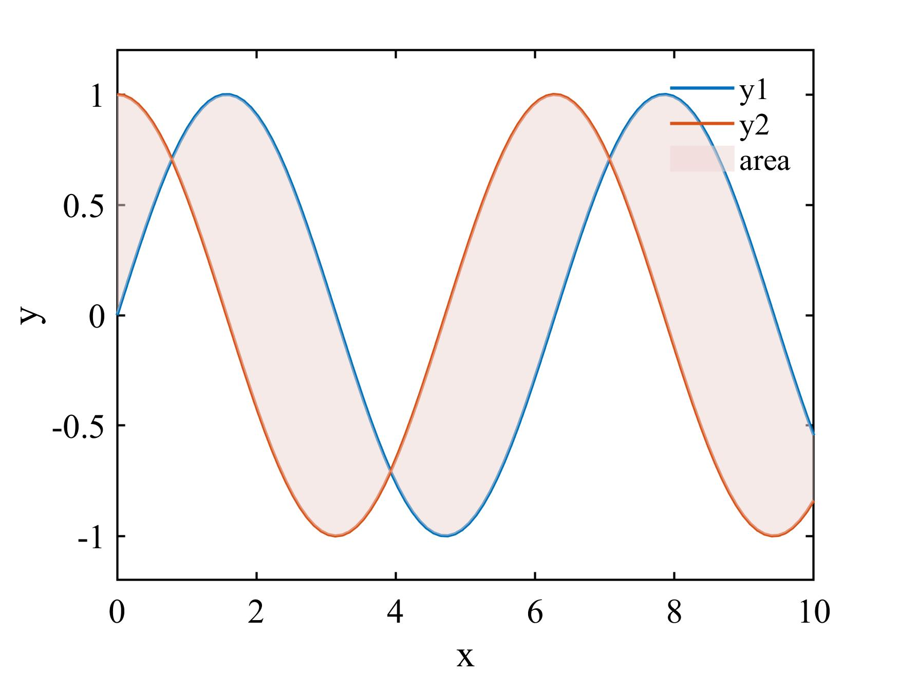
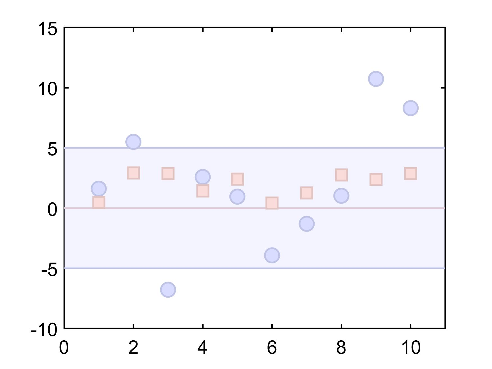
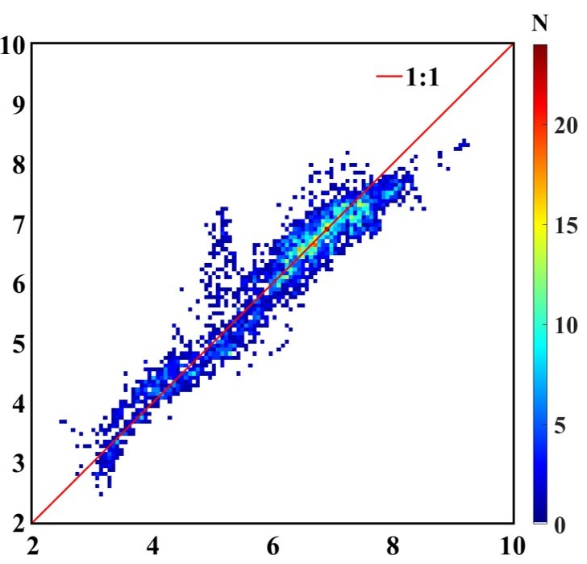
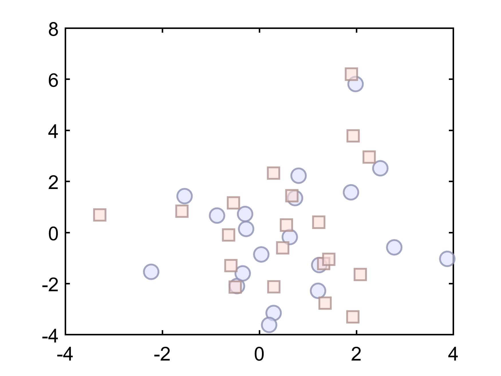

# Matlab (Optic Oceanography)

These Maltab codes are more biased towards the direction of **Ocean Optic Remote sensing**, but they have the same goal in different ways and have enlightenment in all directions.

- [Density Scatter](Density_plot/hist2d_example.m)
   Density plot *Scatter plot with color indicating data density*
- [Bathymetry](M_map_example/bathymetry/bathymetry_example.m)
- [Province Boundary](M_map_example/province_boundary.m)
- [Fill area](FillArea/fill_color.m)
- Supporting files **for m_map**
- [Color imitation](Color_imitation/colorpix_example.m)
- [Alpha Setting](Alpha_fig/alpha_fig.m)
- Unintro
   ...

### [Bathymetry](M_map_example/bathymetry/bathymetry_example.m)

### [Province Boundary](M_map_example/province_boundary.m)

### [Fill area](fillArea/fill_color)

### [Color Imitation](Color_imitation/colorpix_example.m)

### [Density Scatter](Density_plot/hist2d_example.m)

### [Alpha Setting](Alpha_fig/alpha_fig.m)

# Donation

If you have any questions or suggestions about the code, please contact wendian_lai@163.com and I will make corrections in time, Thanks!

